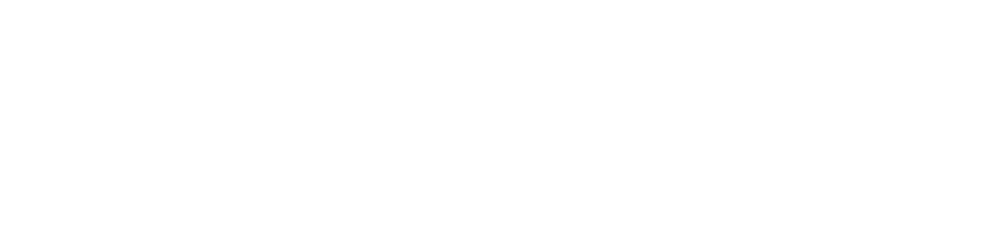
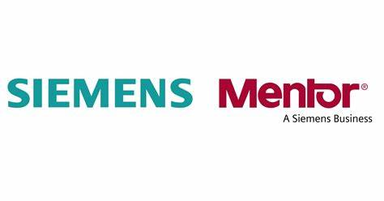
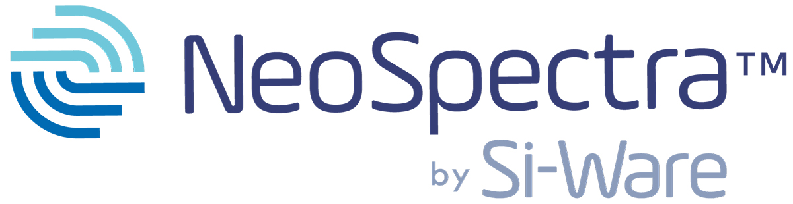
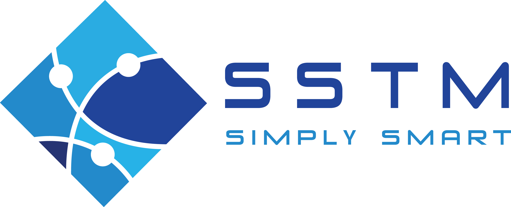
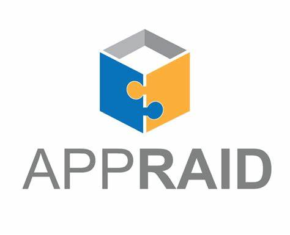
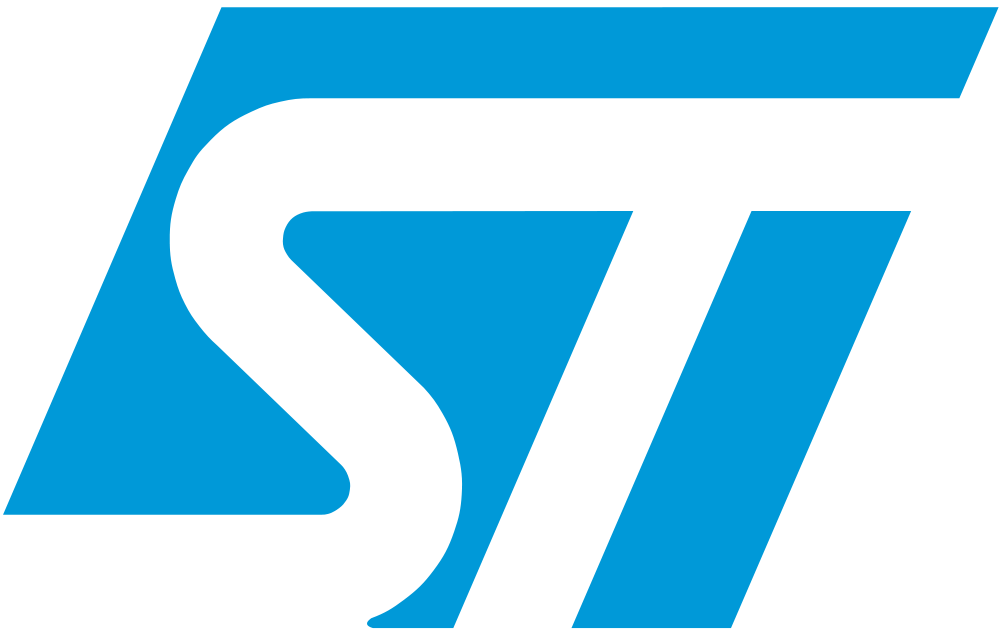
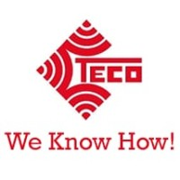

# Embedded_Companies_In_Egypt
List of Embedded Companies In Egypt

# Electronics_Companies_In_Egypt

Hi,

In this repository, you'll find a comprehensive list of Embedded System companies in Egypt for easy reference.

# The List (Companies)

| #   | Logo                                                                      | Company Name                    | Field           | Company/Online Page                                                                                                        | Location                             |
| --- | ---                                                                       | ---                             | ---             | ---                                                                                                                           | ---                                  |
| 1   |              | Affectiva                        | AI              | [Website](https://www.affectiva.com/who/careers/)                                                                           | 5th Settlement, Cairo               |
| 2   |        | Agrisource Data                 | IoT             | [Website](http://agrisourcedata.com/careers/)                                                                             | Nasr City, Cairo                    |
| 3   |  | Al Amin Technological Systems | E Payment       | [Website](http://alamintech.com/)                                                                                    | Heliopolis, Cairo                    |
| 4   |                | Al Manar                         | Electronics     | [Website](http://www.almanar.com.eg/contacts.html)                                                                   | Al Haram, Giza                       |
| 5   |      | Alpha Electronics                | Electronics     | [Website](https://alfagroup-eg.com/alfa-careers/)                                                                 | Heliopolis, Cairo                    |
| 6   |            | ATI Systems                      | Acoustics        | [Website](https://www.atisystem.com/)                                                                                | -                                    |
| 7   |                | Avelabs                          | Automotive       | [Website](http://www.avelabs.com/careers/)                                                                          | Maadi, Cairo                         |
| 8   |               | AvidBeam                         | Automotive / Automation | [Website](https://www.avidbeam.com/careers/)                                                                    | Maadi, Cairo                         |
| 9   |           | BioBusiness                      | Medical          | [Website](http://www.biobusiness-eg.com/contact)                                                                    | Al Haram, Giza                       |
| 10  |           | Brightskies                      | Automotive       | [Website](http://www.brightskiesinc.com/contacts.php)                                                              | Smart Village, Giza & Alexandria     |
| 11  |                  | Ejad                             | Automotive       | [Website](http://ejad.com.eg/careers)                                                                              | Heliopolis, Cairo                    |
| 12  |       | El Sewedy Electrometer                | Electrical Power | [Website](https://sewedy.com.eg/careers/)                                                                 | 6th of October, Giza                 |
| 13  |    | Fruitful Solutions               | IoT              | [LinkedIn](https://www.linkedin.com/company/fruitfulsolutions/)                                                        | Alexandria, Egypt                    |
| 14  |            | Garment IO                        | Garment          | [Website](https://garment.io/careers/)                                                                                  | Sheikh Zayed, Giza                   |
| 15  |          | Goodix Egypt                     | Silicon          | [Facebook](https://www.facebook.com/GoodixEgypt/)                                                                                                 |
| 16  |                 | Idaco                            | Automotive       | [Website](http://www.idaco-egypt.com/index.php/careers)                                                              | 6th of October, Giza                 |              | Heliopolis, Cairo                    |
| 17  |             | Iotsensus                        | IoT              | [Website](https://iotsensus.com/)                                                                                    | Maddi, Cairo                         |
| 18  |       | Mentor Graphics                  | Silicon/Automotive | [Website](https://www.mentor.com/company/careers/)                                                                  | Heliopolis, Cairo                    |
| 19  |  | Misr International Systems   | -                | [Website](http://www.mis-egypt.com/default.aspx)                                                                       | Mohandseen, Giza                     |
| 20  |              | Mogassam                         | 3D Printing       | [Website](http://www.mogassam.com/contact/)                                                                    | Tahrir Sq., Cairo                    |
| 21  |  | National Technology Group     | IoT              | [Website](https://www.ntgegypt.com/information_technology_IT_processing_egypt_middle_east_contact.html)                  | 6th of October, Giza                 |
| 22  |            | Orange Labs                      | IoT              | [LinkedIn](https://www.linkedin.com/company/orangele/)         | [Website](https://orange.jobs/jobs/search.do?lang=EN)                   | Smart Village, Giza                  |
| 23  |             | Si-Vision                        | Silicon          | [Website](https://www.si-vision.com/careers/)                                                                                    | Heliopolis, Cairo                    |
| 24  |               | Si-Ware                          | Silicon          | [Website](https://siwaresystems.recruitee.com/)                                                                                   | Heliopolis, Cairo                    |
| 25  |       | Simply Smart TM                  | IoT              | [Website](https://sstm-eg.com/)                                                                              | Haram, Giza                          |
| 26  |              | Softlock                         | Security         | [Website](http://www.softlock.net/company/Careers)                                                                                 | Nasr City, Cairo                     |                                                   | Cairo                                |
| 27  |             | Swift Act                        | Automotive       | [Website](https://talents.swift-act.com/)                                                                                      | Hadayek El-Ahram, Giza              |
| 28  |            | Thirdwayv                        | IoT              | [Website](http://www.thirdwayv.com/careers/)                                                                                      | Heliopolis, Cairo                    |
| 29  |            | Tigrisnet                        | CCTV             | [Website](https://www.tigrisnet.com/)                                                                                             | Cairo                                |
| 30  |     | TTC Technologies                 | -                | [Website](http://ttctech.com.eg/ttctech.com.eg/contacts.html)                                                                      | Nasr City, Cairo                     |
| 31  |                | Valeo                            | Automotive       | [Website](https://valeo.wd3.myworkdayjobs.com/en-US/valeo_jobs)                                                                                         | Smart Village, Giza                  |
| 32  |               | Xtrava                           | Machine Learning  | [Website](http://xtrava.co/)                                                                                                                               |
| 33  |           | Iskraemeco                       | Electrical Power, IOT, Smart Meters | [Website](https://www.iskraemeco.com/en/)                                                                                                    |
| 34  |              | DevWare                          | Automotive       | [Website](https://devwareauto.com/)                                                                                                | Ain Shams Street, Cairo, Egypt      |
| 35  |              | APPRAID                          | Automotive       | [Website](http://appraid-tech.com/)                                                                                                | Giza, Egypt                          |
| 36  |            | HR Leaps                         | Automotive       | [LinkedIn](https://www.linkedin.com/company/hr-leaps/about/)                                                                        | Mohandseen - Gizah - Egypt            |
| 37  |                  | MED                              | Biomedical       | [Website](http://himedegypt.com/)                                                                                                  | Obour, Egypt                         |
| 38  |   | STMicroelectronics (Former RiotMicro) | IoT, Silicon  | [Website](https://www.st.com/content/st_com/en/about/careers.html)                                                                                                   | Maadi, Egypt                         |
| 39  |         | Mind-blowing                      | IoT              | [Website](https://www.mind-blowing.co/)                                                                                        | New Cairo, Egypt                     |
| 40  |              | Spectro                          | IoT              | [Website](https://spectro.net/careers/)                                                                                   | Maadi, Egypt                         |
| 41  |             | Tekomoro                         | Automotive       | [Website](https://tekomoro.com/)                                                                                               | -                                    |
| 42  |                | esmce                            | Smart meters     | [Website](http://www.esmcegypt.com/Default.aspx)                                                                              | 6th of October City, Giza, Egypt      |
| 43  |        | Global Tronics                    | Smart meters     | [Website](http://www.gtronics.com/)                                                                                            | 6 October                            |
| 44  |            | Vehiclevo                        | Automotive       | [Website](https://vehiclevo.de/)     | Sheikh Zayed, Giza                        |                                                                                                 |
| 45  |           | Axxcelera                        | Telecommunications | [Website](http://www.axxceleraegypt.com/careers/)                                                                              | Maadi, Cairo                         |
| 46  |                | Arcon                            | Medical          | [Website](http://arconme.com/)                                                                                                 | New Cairo                            |
| 47  |                 | TECO                            | Telecommunications | [Website](https://www.linkedin.com/company/tecoeg/) | 7 El-Horeya, Almazah, Heliopolis, Cairo Governorate                      |                                                                                                 |
| 48  |                 | iCity                           | AI | [Website](https://icity.com.sa/)                                                                      |                 |
| 49  |                 | CISS                            | Telecommunication | [Website](https://www.cissegypt.com/)                                                                      | Heliopolis, Cairo, Egypt                       |
| 50  |                 | Nureab                            | Medical | [Website](https://nureab.net/join-us/)                                                                      | Maadi, Cairo                         |
| 51  |                 | Smartec Systems                            | Telecommunications | [Website](https://www.smartec-systems.com/)                                                                      | Dokki, Giza                       |
| 52  |                 | Seitech Solutions                           | Automotive | [Website](https://seitech-solutions.com/career/)                                                                      | Cairo                         |
| 53  |                 | VTS                            | IOT | [Website](https://visionalization.com/)                                                                      | New Damietta, Egypt                     |
| 54  |                 | Roboeye Tech                            | Robotics | [Website](https://www.linkedin.com/company/roboeye-tec/)                                                                      | Nasr city                     |
| 55  |                 | PEmodule                           | Power Electronics | [Website](https://www.linkedin.com/company/pemodule/)                                                                      | Beni Suef                        |
| 56  |                 | Expleo                            | Automotive | [Website](https://careers.expleo.com/en/)                                                                      | Maadi, Cairo                         |
| 57  |                 | IoTech Solutions                            | IOT | [Website](https://www.iotech-solutions.com/)                                                                      | 6 October                       |
| 58  |                 | VxLabs                            | Automotive | [Website](https://vxlabs.de/en/careers/) 
| 59  |                 | Luxoft                            | Automotive | [Website](https://career.luxoft.com/)                                                                      | Mivida, New Cairo                         |
